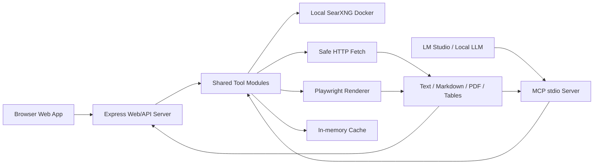
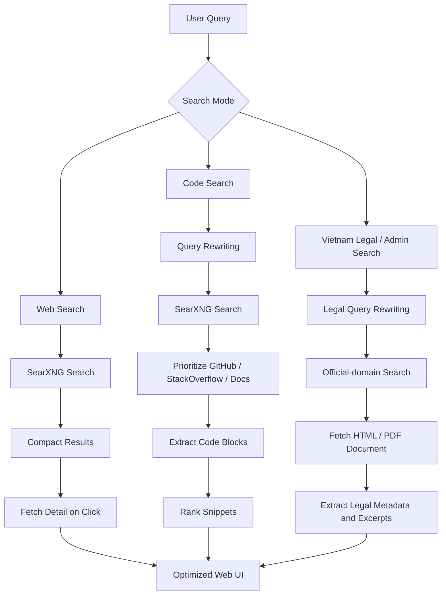

# local-ai-web

Local web search and web reading tools for local LLMs running in **LM Studio**.

## `local-ai-web` adds a small MCP server to LM Studio so your local model can:

- Search the web through a local SearXNG instance.
- Read normal static HTML pages.
- Render JavaScript-heavy SPA pages with Playwright Chromium.
- Extract visible text, rendered HTML, and cleaned Markdown.
- Block localhost/private-network requests to reduce SSRF risk.

## Web Code Search (Internet)

This project now supports **real-time code search from the Internet** via the `search_code_web` tool.

It allows local LLMs (Qwen, Llama, etc.) to:
- find real-world code examples from GitHub / StackOverflow / docs
- extract working code snippets
- reduce hallucination significantly

👉 Works completely local + private (self-hosted SearXNG)

## Vietnam Legal & Administrative Document Research

This project also includes specialized retrieval tools for **Vietnamese law, administrative documents, and public procedures**:

- `search_vietnam_legal`: searches official Vietnamese sources first (`vbpl.vn`, `vanban.chinhphu.vn`, `congbao.chinhphu.vn`, `*.gov.vn`, `quochoi.vn`).
- `fetch_vietnam_legal_document`: fetches a legal/admin document URL and extracts text, Markdown, and heuristic metadata such as document number, authority, issue date, effective-date signals, and citations.
- `vietnam_legal_qa_context`: builds source-backed context for Q&A by searching official sources and fetching top documents.

These tools are designed for retrieval and source grounding. They do not replace a qualified Vietnamese lawyer or a competent authority, and models should cite URLs and state uncertainty when legal effect is not verified.

## Translation

The project includes integrated text translation for both the API/web app and LM Studio MCP:

- `translate_text`: translates text through free/no-key external providers.
- REST endpoint: `POST /api/translate`.
- Web mode: `Dịch thuật`.

Supported providers:

- `auto`: tries configured providers in order.
- `google`: uses an unofficial Google Translate endpoint.
- `mymemory`: uses the public MyMemory translation API.
- `duckduckgo`: experimental best-effort DuckDuckGo Instant Answer lookup. It often does not return translations and is mostly a fallback.
- `lingva`: uses the public Lingva Translate API (privacy-focused Google Translate proxy).

Do not send secrets or sensitive personal data to external translation providers.

> This project is for local research and personal productivity. It does not bypass login pages, paywalls, CAPTCHA, or website access controls.

---

## Table of Contents

- [Architecture](#architecture)
- [Features](#features)
- [Project Structure](#project-structure)
- [How to Set Up](SETUP.md)
- [How to Use](USAGE.md)
- [Development Workflow](#development-workflow)
- [Troubleshooting](#troubleshooting)
- [Security Notes](#security-notes)
- [Limitations](#limitations)
- [Useful Links](#useful-links)
- [License](#license)

---

## Architecture

`local-ai-web` has two local entry points:

- A browser web app served by the Express API server at `http://localhost:3000`.
- An MCP stdio server launched by LM Studio through `mcp.json`.

Both entry points share the same retrieval, extraction, ranking, cache, and safety modules.



The shared tool layer provides these specialized retrieval pipelines:



SearXNG runs in Docker and stays bound to `127.0.0.1`. The Node.js server exposes REST APIs, Swagger UI, and the browser app. The MCP server exposes the same capabilities to LM Studio. All outbound fetch/render paths go through SSRF protection, truncation, and untrusted-content handling before returning data to a model or the web UI.

---

## Features

### `health_check`

Checks whether the MCP server, SearXNG, and Playwright Chromium are ready.

### `search_web`

Searches the web through local SearXNG and returns compact results. Supports time range filtering (`day`, `week`, `month`, `year`) for finding recent information:

```json
{
  "title": "...",
  "url": "...",
  "snippet": "...",
  "source": "example.com"
}
```

### `fetch_url`

Fetches normal static HTML or plain text pages as plain text. Automatically converts GitHub/Gist file URLs to raw content for clean code reading.

### `fetch_markdown`

Fetches static HTML pages and returns cleaned, well-formatted **Markdown**. Automatically converts GitHub/Gist file URLs to raw content and wraps them in code blocks.

Use this for:

- Reading blog articles or documentation.
- Getting high-quality content without boilerplate (headers, footers, ads).
- Preserving tables and formatting via GFM (GitHub Flavored Markdown).

### `list_github_repo`

Lists files and directories in a GitHub repository or subdirectory. Useful for exploring repository structures before reading specific files.

### `fetch_rendered_source`

Renders JavaScript-heavy pages in headless Chromium and returns visible text and/or rendered DOM HTML.

Use this for:

- React apps.
- Vue apps.
- Angular apps.
- Next.js/Nuxt pages.
- SPA pages where normal HTTP fetch only returns an empty shell.

### `fetch_rendered_markdown`

Renders a page with Chromium, extracts the main content, and converts it to Markdown.

This is usually the best tool for LLM summarization.

### `fetch_document`

Fetches and extracts raw text from PDF files and other supported documents.

Use this for:
- Research papers (PDFs).
- Manuals and technical documentation.

### `extract_structured_data`

Extracts high-fidelity data that often gets lost in standard text conversion. Automatically detects HTML tables and converts them to Markdown, and extracts JSON-LD metadata. Supports an optional `render` flag for SPAs.

Use this for:
- Extracting tables of data (e.g., pricing, specifications).
- Reading product or recipe metadata.

### OpenAPI API Server

Includes a standalone Express server providing REST APIs and a Swagger UI for executing all web search and reading features independently of LM Studio.

### Angular SPA Web App

Includes a modern Single Page Application (SPA) web frontend built using **Angular** and styled with **Pico.css v2** for clean, responsive, semantic aesthetics. It is served by the same Express server.

To access the web app, run the container stack or start the local API server and open:

```text
http://localhost:3000
```

The app features:
- **Search modes**: Tabbed search interface for `Web`, `Mã nguồn` (Code), `Văn bản pháp luật` (Legal Documents), `Thủ tục hành chính` (Administrative Procedures), and `PDF`.
- **Integrated Translation**: A dedicated translation page supporting multiple free translation APIs (including Google Translate, MyMemory, and Lingva Translate) with a persistent translation history log saved in your browser.
- **Optimized UI**: Responsive dual-pane layout showing results and detailed previews cleanly side-by-side.

Swagger remains available at:

```text
http://localhost:3000/docs
```

### `clear_cache`

Clears in-memory cache.

### `cache_stats`

Shows in-memory cache statistics (e.g. memory usage, cache size).

### `close_browser`

Closes the background Playwright Chromium browser instance to free up memory.

### `translate_text`

Translates text using free/no-key external providers. Provider `auto` tries the configured provider list; `google` and `mymemory` are the practical defaults, while `duckduckgo` is experimental.

### `search_code_web`

  - Web code search
  - multi-query search via SearXNG
  - GitHub raw code extraction
  - StackOverflow snippet extraction
  - automatic ranking (best snippet first)

### `search_vietnam_legal`

Searches official Vietnamese legal/admin sources using retrieval-friendly query rewrites. Use this before answering questions about Vietnamese law, administrative-document format, or public procedures.

### `fetch_vietnam_legal_document`

Fetches a Vietnamese legal/admin URL and returns extracted text, Markdown, and heuristic metadata including document number, document type, issuing authority, date signals, status signals, and cited documents.

### `vietnam_legal_qa_context`

Builds source-backed context for Vietnamese legal/admin Q&A by combining official-source search with top-document fetching and relevant excerpt selection.

---

## Project Structure

Recommended structure:

```text
local-ai-web/
├─ README.md
├─ SECURITY.md
├─ .env.example
├─ .gitignore
├─ docker-compose.yml      # Starts SearXNG + mcp-web-reader together
├─ searxng/
│  └─ config/
│     └─ settings.yml
├─ mcp-web-reader/
│  ├─ package.json
│  ├─ tsconfig.json
│  ├─ Dockerfile           # Multi-stage Docker image
│  ├─ src/
│  │  ├─ index.ts          # Server entry point
│  │  ├─ browser.ts        # Playwright browser management
│  │  ├─ tools.ts          # MCP tool definitions & handlers
│  │  ├─ searxng.ts        # SearXNG API client
│  │  ├─ code_web.ts       # Code search & extraction logic
│  │  ├─ legal_vn.ts       # Vietnam legal/admin search & extraction logic
│  │  ├─ translate.ts      # Translation provider integration
│  │  ├─ structured.ts     # Table & Metadata extraction
│  │  ├─ cache.ts          # In-memory caching
│  │  ├─ extract.ts        # HTML to Markdown/Text extraction
│  │  ├─ config.ts         # Environment configuration
│  │  ├─ helper.ts         # Utility functions
│  │  ├─ security.ts       # SSRF & domain filtering
│  │  ├─ log.ts            # Logging utilities
│  │  ├─ http.ts           # Standalone API Server
│  │  └─ swagger.ts        # OpenAPI Specification
│  ├─ public/              # Compiled static Angular SPA assets
│  ├─ frontend/            # Angular SPA source project folder
│  └─ scripts/
│     ├─ print-mcp-config.js
│     └─ verify.js
└─ examples/
   ├─ prompts.md
   ├─ mcp.windows.json
   ├─ mcp.macos.json
   └─ mcp.linux.json
```

## How to Set Up

Please refer to [SETUP.md](SETUP.md) for detailed instructions on:
- Requirements
- Installing Docker
- Installing Node.js
- Setting up SearXNG
- Setting up the MCP Server
- Configuring LM Studio

---

## How to Use

Please refer to [USAGE.md](USAGE.md) for detailed instructions on:
- Searching code snippets
- Recommended System Prompts
- GitHub Raw Optimization
- Example prompts for each feature
```

---

## Development Workflow

Start SearXNG:

```bash
docker compose up -d
```

Stop SearXNG:

```bash
docker compose down
```

Rebuild MCP after backend changes:

```bash
cd mcp-web-reader
npm run build
```

Rebuild Angular frontend SPA:

```bash
cd mcp-web-reader/frontend
npm run build
```

Run Angular frontend in dev mode (runs server on port 4200, proxies requests to port 3000):

```bash
cd mcp-web-reader/frontend
npm start
```

Watch TypeScript changes:

```bash
npm run build:watch
```

`build:watch` rebuilds `dist/index.js`, but the running MCP process still needs to be restarted or reconnected in LM Studio.

---

## Troubleshooting

### `TS7016: Could not find a declaration file for module 'jsdom'`

```bash
npm install -D @types/jsdom
npm run build
```

### SearXNG returns `403 Forbidden` for JSON

Make sure `searxng/config/settings.yml` contains:

```yaml
search:
  formats:
    - html
    - json
```

Restart SearXNG:

```bash
docker compose restart searxng
```

### SearXNG logs many `403` / `Too many request` / `CAPTCHA` engine errors

Some upstream engines rate-limit or CAPTCHA data-center/shared IPs aggressively.
You can limit MCP queries to a smaller set of engines:

```env
SEARXNG_ENGINES=google,bing
```

Then restart MCP (or reconnect in LM Studio).

If `SEARXNG_ENGINES` is not set, MCP automatically uses `google,bing,wikipedia`.

### Port 8080 is already in use

Edit `.env`:

```env
SEARXNG_PORT=8888
SEARXNG_URL=http://127.0.0.1:8888
```

Restart:

```bash
docker compose down
docker compose up -d
```

Regenerate LM Studio config:

```bash
cd mcp-web-reader
npm run print:mcp
```

### LM Studio does not show tools

```bash
cd mcp-web-reader
npm run build
npm run print:mcp
```

Make sure `mcp.json` uses the absolute path to `dist/index.js`.

### Playwright browser is missing

```bash
npx playwright install chromium
```

Linux:

```bash
npx playwright install --with-deps chromium
```

### Static fetch returns an empty shell

Use `fetch_rendered_source` or `fetch_rendered_markdown`.

### Rendered fetch misses lazy-loaded content

Try higher `wait_ms` and `scroll_steps`:

```text
Use fetch_rendered_markdown with wait_ms=5000 and scroll_steps=8.
```

---

## Security Notes

Do not add shell or filesystem tools to this MCP server unless you fully understand the risk.

Keep SearXNG bound to `127.0.0.1` unless you know what you are doing.

For high-trust workflows, set `ALLOW_DOMAINS`:

```env
ALLOW_DOMAINS=lmstudio.ai,github.com,docs.searxng.org
```

Treat every web page as untrusted input.

---

## Limitations

This project cannot reliably extract:

- Login-only content.
- CAPTCHA-protected content.
- Heavily anti-bot-protected content.
- Paywalled content.
- Canvas/WebGL-only text.
- Content requiring complex user interaction.
- Some websites block scraping
- Dynamic sites may require rendering
- Not all pages contain clean code blocks
- GitHub issues are ignored

It does not bypass website access controls.

---

## Useful Links

- LM Studio MCP docs: https://lmstudio.ai/docs/app/mcp
- SearXNG Search API: https://docs.searxng.org/dev/search_api.html
- Docker Desktop: https://docs.docker.com/get-started/introduction/get-docker-desktop/
- Docker Engine Ubuntu: https://docs.docker.com/engine/install/ubuntu/
- Node.js downloads: https://nodejs.org/en/download
- MCP TypeScript SDK: https://www.npmjs.com/package/@modelcontextprotocol/sdk
- Playwright: https://playwright.dev/docs/intro

---

## License

[MIT](LICENSE)
